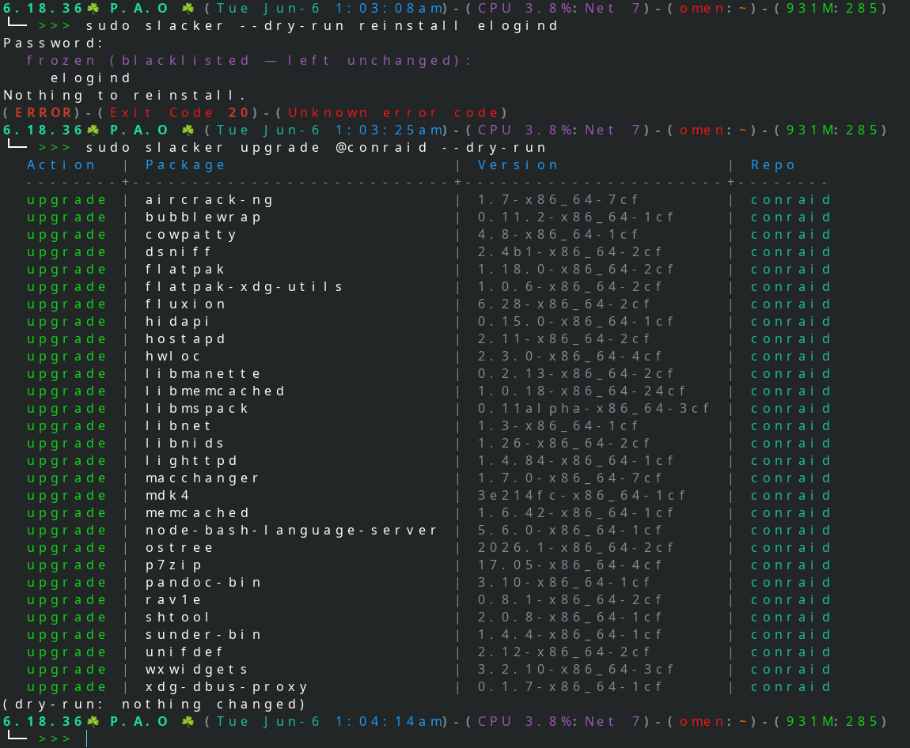
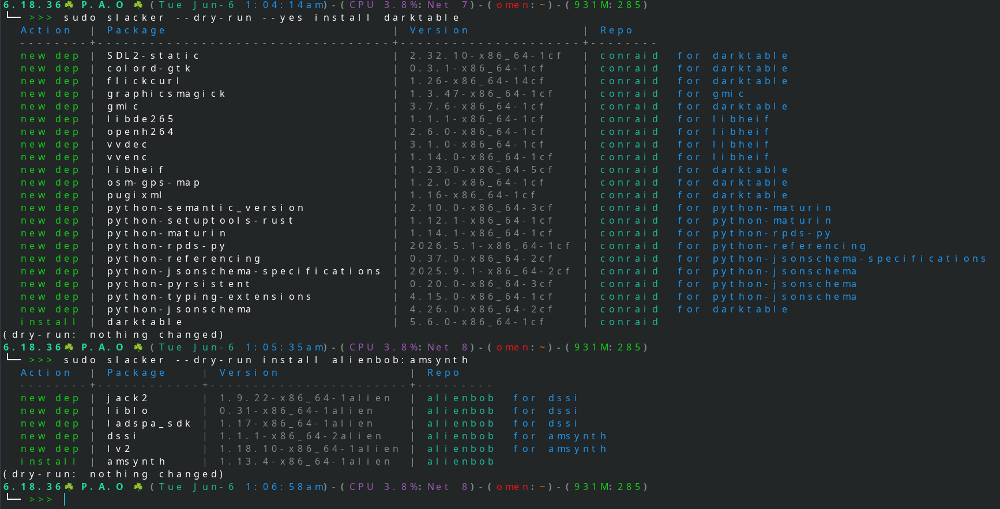
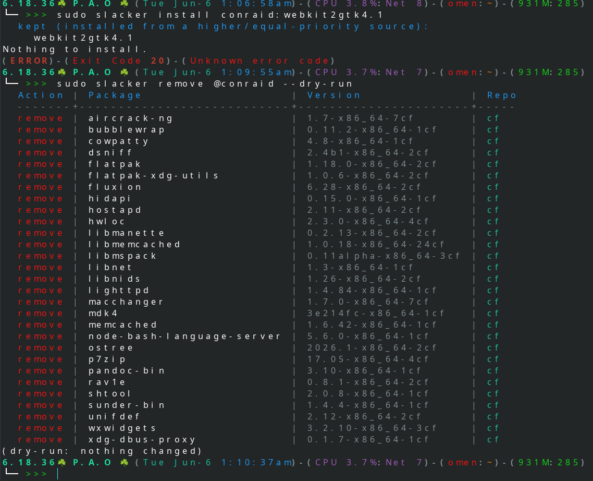
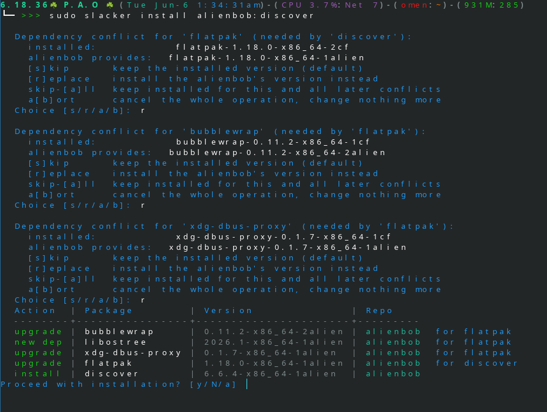
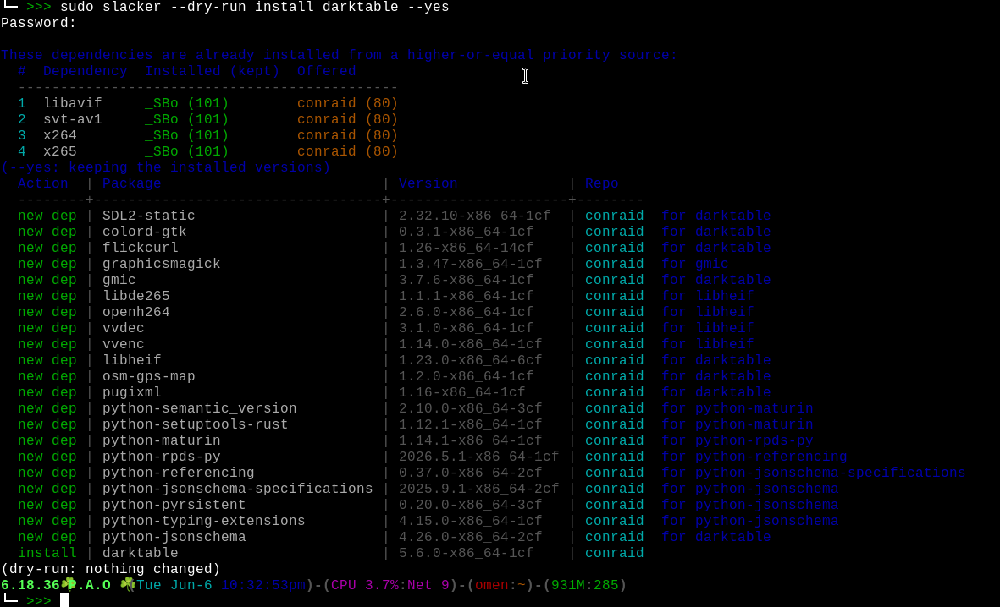

---

# slacker - slackpkg + slackpkg+ in one

A Slackware package manager in Rust with full **slackpkg action parity**, plus
**slackpkg+ multi-repo priority** resolution.

- slackpkg: official mirror, update/install/upgrade/remove/clean-system, file-
  search, templates, ChangeLog tracking, GPG, .new config handling.
- slackpkg+: many repos in one priority-ordered model; the official mirror is
  just a repo whose priority you choose, so it can sit in any position.

## Philosophy

- Thin layer over the native pkgtools - never reimplements
  installpkg/upgradepkg/removepkg, just calls them.
- Dependencies come only from a package's own `.dep` file (opt-in, like
  slackpkg+); no dependency *guessing* - Slackware tradition.
- Synchronous; heavy lifting (bzip2 for MANIFEST, GPG) shells out to the
  system tools Slackware already ships, so no extra Rust deps.
- Everything a user edits is plain text.

## Install

On Slackware you install the **binary package** (built from the SlackBuild). The
package puts everything in place for you — the `slacker` binary, the man page,
and the config files under `/etc/slacker/`. You do **not** copy any files. After
installing, the only edits needed are:

1. uncomment exactly one mirror in `/etc/slacker/mirrors`, and
2. set your repo priorities (and any external repos) in `/etc/slacker/repos`.

Then `slacker update gpg` once, `slacker update`, and you are ready.

## Build (from source — for developers)

Building needs Rust **1.85.1+** (the effective MSRV; current Slackware ships
1.96). The crate is edition 2021, but a dependency — `clap_lex`, edition 2024 —
sets that 1.85.1 floor.

    cargo build --release
    install -m0755 target/release/slacker /usr/sbin/slacker
    install -m0644 slacker.8 /usr/man/man8/slacker.8

See `slacker.8` (`man slacker`) for the full manual.

## Configuration  (/etc/slacker/)

    slacker.conf   KEY=value globals (ARCH, ADM_DIR, CACHE_DIR, PKG_DB_DIR, RESOLVE_DEPS, IGNORE_TAGS, VERIFY)
    mirrors        catalogue of official mirrors - uncomment exactly ONE
    repos          repo priorities/names + external repos
    blacklist      blacklist rules: [@repo] REGEX | [@repo] series/
    templates/     generated/created templates

`ADM_DIR` (default `/var/adm`) is the Slackware pkgtools admin root, where the
installed-package database and the removed-package records live; `history` reads
it. `PKG_DB_DIR` defaults to `ADM_DIR/packages` — set it explicitly only to
override that.

### mirrors

A slackpkg-style catalogue. Uncomment exactly one line for your architecture
and release (current vs 15.0; slackware64 for x86_64, slackware for 32-bit).
slacker
errors out if two are active. Change your default mirror by changing which line
is uncommented.

### repos

    # priority  name        url                                              [flags]
    100         slackware   mirror                                           official
    90          extras      mirror/extra                                     subtree immutable
    80          ktown       https://slackware.nl/people/alien/ktown/current/x86_64
    60          alienbob    https://slackware.nl/people/alien/sbrepos/current/x86_64

Higher priority wins. Pin a repo with `name:package`. The URL field accepts a
literal URL, or one of two keywords filled in from the active line in `mirrors`:

- **`mirror`** — the mirror URL as-is (use it for the official repo); URL lives
  in `mirrors`, priority/placement live here.
- **`mirror/<subpath>`** — the active mirror with a subpath appended, e.g.
  **`mirror/extra`**, `mirror/testing`, `mirror/patches`. This tracks a
  distribution subtree on whichever mirror you picked, without hardcoding the
  host: change the mirror and these follow. Combine with the `subtree` flag.

Flags (any order):

- **`official`** - marks the tracked repo (ChangeLog, install-new default);
  placement is still by priority only.
- **`immutable`** - keeps every package attributed to this repo out of
  `clean-system` (use it for `extra/`, `testing/`, `patches/` you keep
  installed, instead of blacklisting each one).
- **`subtree`** - this URL is a Slackware distribution subtree (`extra/`,
  `patches/`, `testing/`, `pasture/`). Their `PACKAGES.TXT` lists package
  locations relative to the distribution **root**, so packages and `GPG-KEY` are
  fetched from the parent (root) URL while metadata comes from the URL itself.
  Without this, those packages 404 with a doubled path segment.
- **`verify=`** - per-repo verification override (see Security note).

`add-repo`, `del-repo`, `add-tag`, `del-tag` edit this file for you (validated,
with a confirmation prompt).

**URL schemes:** `https://`, `http://`, and `file://` are supported (the last
for a local clone, NFS mount, or mounted media - three slashes for an absolute
path). A URL points at the repo root containing PACKAGES.TXT; for official
mirrors, MANIFEST.bz2 lives in a per-arch subdir which slacker finds
automatically.

---

## Actions (slackpkg-compatible)

    slacker update [gpg]          refresh metadata; `update gpg` imports repo keys
    slacker check-updates         per-repo update check; exit 100 if any pending
    slacker show-changelog [REPO] print a ChangeLog (official by default, or a named repo)
    slacker history [NAME]        chronological log of package changes (install/upgrade/remove), newest first
    slacker status                health-check the whole setup; says what to fix next
    slacker list-repos            list repos: priority, verify, flags, installed counts
    slacker search PACKAGE        find a package by its exact name (case-insensitive)
    slacker file-search FILE      which package ships FILE (MANIFEST)
    slacker info PACKAGE          per-repo candidates + installed version
    slacker install PATTERN...    install new packages (refuses installed ones)
    slacker upgrade PATTERN...    upgrade installed packages
    slacker reinstall PATTERN...  reinstall current version
    slacker remove PATTERN...     remove installed packages
    slacker download PATTERN...   download to CACHE_DIR/packages/<repo>/ (or -o DIR), don't install
    slacker clean-cache [REPO...] delete downloaded *.txz (keeps metadata + GPG keys)
    slacker upgrade-all           upgrade everything with a newer revision
    slacker install-new [REPO...] install newly-added packages (official only by default)
    slacker clean-system          remove packages no longer in the official baseline
    slacker frozen RULE...        add blacklist rule(s): name/regex, series/, or @repo-scoped
    slacker new-config            handle leftover *.new config files
    slacker add-repo  P NAME URL [official|immutable|subtree|verify=...]   add a repo line
    slacker del-repo  NAME        remove a repo line
    slacker add-tag   P NAME TAG  add a build-tag priority line (e.g. 100 SBo _SBo)
    slacker del-tag   TAG         remove a build-tag priority line
    slacker vet-repo  NAME        re-vet a repo on demand (quarantine on fail, clear on pass)
    slacker trust-repo NAME       lift a repo's quarantine (override the verdict)
    slacker distrust-repo NAME    manually quarantine (freeze) a repo
    slacker generate-template N   snapshot installed packages to template N
    slacker install-template N    install everything in template N
    slacker remove-template N     uninstall every package in template N
    slacker delete-template N     delete the template file (keeps packages)

PATTERN is a package name, a name substring, a series (a, ap, n, kde, xap, ...),
a `repo:name` pin, or a set selector `@repo` / `@_tag`. Global flags: `-y/--yes`,
`--dry-run`, `--no-deps`, `--config-dir`.

## Exit status (matches slackpkg)

    0    success
    1    error
    20   nothing found to act on
    50   slacker upgraded itself; re-run
    100  pending updates (check-updates)

## Security note

GPG: `update gpg` imports each repo's GPG-KEY into a private keyring under the
cache dir; subsequent `update` verifies CHECKSUMS.md5 against
CHECKSUMS.md5.asc. At install, integrity is checked per package: Slackware ships
a per-package `.txz.asc`, so under the default `all` policy slacker GPG-verifies
the package itself when a signature is present (falling back to the md5 from the
signature-verified CHECKSUMS otherwise), and prints which checks passed. A repo
with verification effectively off is flagged with a warning. Run
`slacker update gpg` once before trusting a mirror.

**Key pinning (TOFU):** the first GPG-KEY import pins the repo's fingerprint;
any later key change is refused as a possible key-substitution attack rather
than trusted silently. For a `subtree` repo the key is fetched from the root,
where Slackware keeps the single key that signs the whole tree (so `extra/`,
`testing/`, `patches/` pin the same fingerprint as the official repo).

**Quarantine & trust:** a repo that fails vetting (unreachable, or serving
malformed/hostile metadata) is auto-quarantined and provides no packages until
you act. New/untrusted repos are light-vetted on the next `update`; `add-repo`
and `vet-repo` vet thoroughly. Use `trust-repo` to lift a quarantine you judge a
false positive, `distrust-repo` to freeze a repo yourself, and `vet-repo` to
re-check. `list-repos` and `status` show the state.

---

## Notes / limits

- Selector matching (install/upgrade/remove/...) is substring + series + exact,
  not regex. The **blacklist** is different: its rules are unanchored regular
  expressions (plus `series/` and `@repo` scoping) matched against the full
  package id — see `frozen` and the `blacklist` file.
- The `repos` file also accepts **build-tag priority** lines (`priority name tag`,
  e.g. `100 SBo _SBo`) that give SlackBuilds.org/local packages a priority on the
  same scale as repos. `upgrade-all` then only replaces a tagged package with a
  candidate from a higher- or equal-priority repo, so SBo/local packages are
  never silently migrated to another repo or downgraded.
- Two explicit set selectors (the `@` is required, so a bare word is never a
  repo):
  - `@repo` means "every package in that repo" - e.g. `install @gnome` installs
    the whole gnome repo, `remove @gnome` removes the installed packages that
    came from it.
  - `@_tag` means "every package with that build tag" - e.g. `remove @_SBo`
    removes all installed SlackBuilds.org packages.
  Give a repo a distinct, high priority and its packages (carrying their own
  build tag, e.g. `_gnome`) are protected: no other repo can replace or
  "upgrade" them, even with a newer version, because priority wins.
- When an `install`/`upgrade`/`reinstall` pattern matches more than one package,
  slacker shows a numbered list and lets you choose which to act on (Enter for
  all, numbers/ranges like `1 3 5` or `2-4`, `n` to cancel). A series name
  (`a`, `ap`, `kde`, `y`, ...) matches exactly that series, not every package
  whose name happens to contain those letters.
- `install-new` installs packages whose **name** is newly added to a repo since
  the last `update` (genuinely new to the distribution) — **not** packages you
  removed or never installed, which already exist in the tree; use `slacker
  install NAME` (or `install @repo`) for those. Example: after an `update` that
  introduces a brand-new `libfoo`, `install-new` offers `libfoo`, but it never
  offers `emacs` just because you removed it. By default it considers only the
  **official** repo(s); name one or more repos to opt in explicitly (e.g.
  `slacker install-new alienbob`).
- `frozen <rule>...` adds one or more rules to the `blacklist`. A rule is a
  name/regex, a `series/`, or an `@repo`-scoped form (quote rules with spaces,
  e.g. `slacker frozen "@alienbob vlc"`). slacker validates each rule, flags a
  likely mistake (an `@repo` that names no active repo, or a regex containing a
  space — a forgotten `@` or quoting slip), prints what each rule will freeze,
  and asks before writing (`--yes` skips the prompts). An installed match is
  frozen; an uninstalled match is hidden from install-new/upgrades but still
  shown by `search`/`info` marked `[blacklisted]`.
- `remove-template <name>` uninstalls the packages a template lists (slackpkg
  behaviour); `delete-template <name>` removes only the template file.
- `clean-system` lists installed packages that are **no longer part of the
  official distribution** - foreign meaning absent from the baseline (the
  official repo's `PACKAGES.TXT` plus any `immutable` repo), slackpkg-style. So
  a package the distro itself dropped is removed even if some third-party repo
  still ships the name. Pick which to remove (numbers to keep, Enter to remove
  all). A package is kept when any of three holds: it matches a `blacklist`
  rule; its build tag is in `IGNORE_TAGS` (e.g. `_SBo cf alien`); or it is
  attributed to an `immutable` repo (its tag-owning repo, or for a tagless
  package any immutable repo that provides its name). Mark `extra/`/`testing/`/
  `patches/` repos `immutable` to keep their packages without blacklisting each
  one. As a safety guard, `clean-system` refuses to run if a baseline repo has
  no metadata loaded (run `update` first).
- The `blacklist` is honoured by every mutating command (including `reinstall`), packages it freezes never appear in `clean-system`, and a frozen/blacklisted package is flagged `[blacklisted]` in `search` and `info`.
- ChangeLog is fetched (on `update`) only for the official repo, and powers
  `show-changelog`. `check-updates` covers every repo: official via ChangeLog,
  external repos by comparing CHECKSUMS.md5 to the cached copy.
- `history [NAME]` prints a newest-first log of every package change on the box —
  installed, upgraded, reinstalled, removed — with the local date and the source
  repo/tag. It is reconstructed from the pkgtools admin directories under
  `ADM_DIR` (`packages/` + `removed_packages/`), so it also reflects changes made
  by other tools (slackpkg, sbopkg, installpkg/upgradepkg/removepkg), not just
  slacker. Filter with `--installed`, `--removed`, `--upgraded`, `--last N`, or
  `--since YYYY-MM-DD`; name a package to limit the log to it. (Because plain
  `removepkg` records collide on the package id in `removed_packages`, an upgrade
  whose target record was overwritten shows the version inferred from that
  package's next known entry rather than a literal `?`.)

---

  
## Dependencies (.dep files)

If a package has a `.dep` file next to it in the repository (one dependency
package name per line), slacker reads it and pulls in missing dependencies from
the same repository, recursively, before installing. Dependencies already
satisfied by that repo's build are left alone; one that is installed but differs
from what the repo offers (e.g. from another source) prompts: skip / replace /
skip-all / abort (with `--yes`, the installed version is kept).

On by default; disable with `RESOLVE_DEPS=no` in `slacker.conf`, or per-run with
`--no-deps`. Applies to install, upgrade, reinstall, upgrade-all, install-new
and install-template.

---

## NOTE

**slacker** status is `developing mode` and that means:
1. It not building for slackware(64)-15.0 and it will never be.
2. Build and run fine for slackware64-current **only for testers**... 
3. It is not ready even for testing for slackware-current (32bit) but will be soon.
