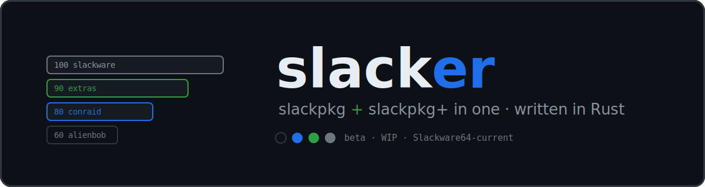

---

# slacker - slackpkg + slackpkg+ in one

A Slackware package manager in Rust with full **slackpkg action parity**, plus
**slackpkg+-style multi-repo priority** resolution.

- slackpkg: official mirror, update/install/upgrade/remove/clean-system, file-
  search, templates, ChangeLog tracking, GPG, .new config handling.
- slackpkg+: many repos in one priority-ordered model; the official mirror is
  just a repo whose priority you choose, so it can sit in any position.

## Philosophy


- Thin layer over the native pkgtools - never reimplements
  installpkg/upgradepkg/removepkg, just calls them.
- **Dependency resolution is the repository's responsibility, not the package
  manager's.** Official Slackware ships none, so official packages get no
  auto-resolved deps - the Slackware tradition, kept on purpose. Where a
  *third-party* repo chooses to declare them (a package's own `.dep`, or a
  `PACKAGE REQUIRED:` line in `PACKAGES.TXT`), slacker honours that declaration
  at the repo's responsibility - it never *guesses* - and you can switch it off
  (`RESOLVE_DEPS=off`, or `--no-deps` per run).
- Synchronous; heavy lifting (bzip2 for MANIFEST, GPG) shells out to the
  system tools Slackware already ships, so no extra Rust deps.
- Everything a user edits is plain text.

# Wiki

Everything you need to know about slacker: [Wiki](https://forge.slackware.nl/rizitis/slacker/wiki)

## NOTE: 
**slacker** source code is beta and **slacker** [wiki](https://forge.slackware.nl/rizitis/slacker/wiki) is a WIP.

---

[](https://asciinema.org/a/hQvscQ2URkx92EJq)
---

# slacker - Development & Release Model

## TL;DR

slacker targets **Slackware-current**, *not* Slackware stable. It does **not** build
on the current stable (15.0). Releases are versioned `0.x.x_beta.x`, which is a
deliberate, fluid pre-stable state - neither classic alpha nor classic beta. A
*frozen* "stable" slacker only appears when Slackware itself ships a new stable
release, and when it does, the slacker version number **matches the Slackware
version** (e.g. `15.1`, `16.0`) - never `1.x.x`.

---

## Current state: why `0.x.x_beta.x`?

slacker is developed **exclusively against slackware-current**. It does *not*
support the current Slackware stable (15.0). Because there is no stable Slackware
target for it yet, the version starts at `0.` and stays there.

The `_beta.x` suffix is intentional and slightly unconventional:

- There are **no alpha releases** - slacker never goes through a separate alpha phase.
- So while the leading `0.` is present, slacker is **not alpha** - but it is
  **not pure beta** either.
- It is a deliberately **fluid state**: the codebase is stable enough to install,
  use and test on slackware-current, yet the design is *not locked*. If a genuinely
  good idea shows up, it can still be merged into the `0.x` line.

In short: `0.x.x_beta.x` means *"usable and under active testing on
slackware-current, but the design is open and good ideas are still welcome."*

---

## Why RC almost never appears (and why that's on purpose)

There is intentionally **no steady stream of release candidates**. RC is *not* a
routine phase in this project.

A release candidate is cut **only** when Slackware itself is about to ship a new
stable release. That single event is the *only* trigger for an RC. As a result:

- RC will feel rare and "late" - **this is by design**, not neglect.
- When it does happen, the RC window is **very short**. Within a few days
  (barring something unexpected) the RC is frozen into a stable release.

---

## Why freezing matters: the Rust toolchain

slacker is built in **Rust**, and that is what drives the freeze.

When slackware-current becomes the next Slackware stable, **the entire toolchain -
the Rust compiler and every build dependency - is pinned to the exact versions
shipped in that stable.** From that moment on:

- The frozen slacker build is **reproducible** against that Slackware release for years.
- It receives **maintenance only**; the locked toolchain does not move.

This short **RC => freeze** cycle exists precisely to lock slacker to a
known-good Rust/Slackware combination at the instant Slackware stabilizes.

---

## Version numbers follow Slackware, not SemVer 1.0

slacker will **never** jump to `1.x.x`. A frozen stable slacker instead takes the
**exact version number of the Slackware stable it is frozen against**:

| slacker version | Frozen for          |
|-----------------|---------------------|
| `15.1`          | Slackware 15.1      |
| `16.0`          | Slackware 16.0      |
| …               | …                   |

The version number therefore tells you precisely **which Slackware stable** a
frozen slacker belongs to. (The first frozen release will be the next Slackware
stable after 15.0 - `15.1` or `16.0`, whatever Slackware names it.)

---

## Two tracks at once

After a freeze, development does **not** stop. There are effectively two parallel lines:

1. **Frozen stable** (`15.1`, `16.0`, …)
   Pinned toolchain, maintenance-only, tied to exactly one Slackware stable.

2. **slacker-current** (`0.x.x_beta.x` => next RC)
   **Never freezes.** It keeps moving with slackware-current - accumulating fixes
   and good ideas - for as many years as it takes, until the next Slackware stable
   arrives. Then the cycle repeats: short RC => freeze => a new version matching the
   new Slackware stable.

---

## The cycle, summarized

1. **Develop** continuously on slackware-current as `0.x.x_beta.x`
   (no alpha, fluid beta, good ideas can still land).
2. Slackware approaches a new stable => **cut an RC**.
3. RC **freezes within days** => pin the Rust toolchain + all dependencies.
4. **Release** the frozen slacker, numbered to match the Slackware stable
   (`15.1`, `16.0`, …).
5. slacker-current **keeps developing** toward the next cycle. **Repeat.**

```
slackware-current ──► 0.x.x_beta.x ──► 0.x.x_beta.(x+1) ──► … (years) … ──► RC ──► FREEZE
                                                                                    │
                                                                                    ▼
                                                                      slacker 15.1 / 16.0 (frozen)
                                                                                    │
                       (development never stops, a new 0.x line continues) ◄────────┘
```

---

## Verifying a release

These packages are signed with my GPG key:

    fingerprint: 83A5 99D8 E916 3074 2706  CD0E 1463 A5BD 1FD9 2D7B
    Ioannis Anagnostakis <rizitis@gmail.com>

Fetch the key once, then verify any release:

    gpg --keyserver hkps://keys.openpgp.org --recv-keys 83A599D8E91630742706CD0E1463A5BD1FD92D7B
    gpg --verify slacker-0.9.0-x86_64-1_FRG.txz.asc slacker-0.9.0-x86_64-1_FRG.txz

A `"Good signature from Ioannis Anagnostakis <rizitis@gmail.com>"` line means the
package is authentic and untampered.

---

## How you can help

If you run **slackware-current** (always up to date), you can build slacker from source or install the binary provided in every release, use it, and
report what you find:

- **Bug reports / issues** are very welcome.
- Please include your **slackware-current state** (e.g. the date you last upgraded)
  and your **Rust version** (`rustc --version`).
- **Ideas are welcome too** - thanks to the fluid `0.x` model, a strong idea can
  genuinely make it into the codebase.

> **Note:** GitHub repository is a **read-only mirror**. Development happens
> upstream at <https://forge.slackware.nl/rizitis/slacker>. You may open **issues** there, download releases,
> but send any **patches upstream**.

---

### Development Approach

- This project is developed using AI-assisted tools. Code is generated with the help of AI based on human-provided specifications, design decisions, and iterative feedback.
- All contributions are reviewed, tested, and curated by the maintainer before being included in the codebase. AI is used as a productivity and exploration tool, while human oversight remains central to all decisions.

> The goal is to combine the flexibility of AI-assisted development with standard open-source practices such as transparency, review, and accountability.
